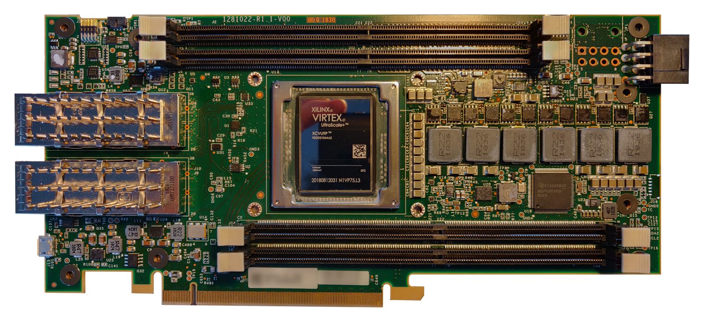
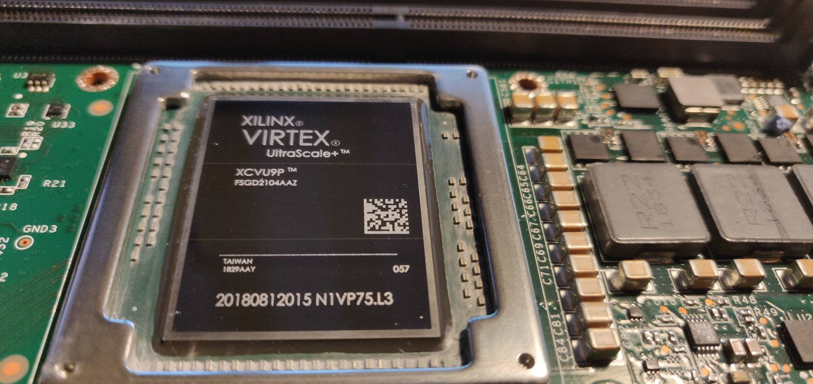
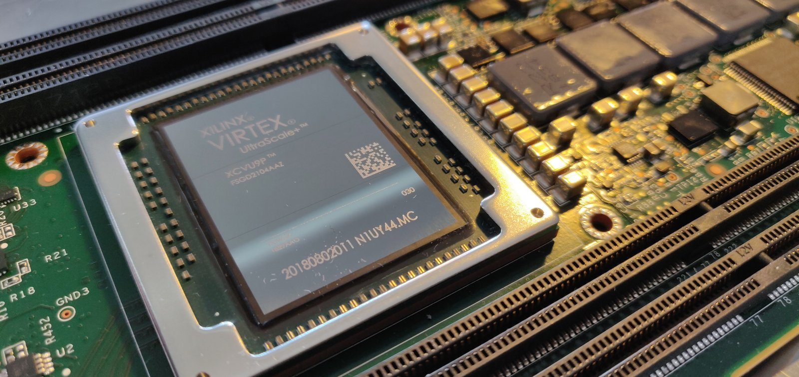

# VCU1525 ethash in HLS

Just-for-fun: Ethereum's **ethash** proof-of-work algorithm on a Xilinx **BCU1525**, the mining-market version of the VCU1525 Virtex UltraScale+ accelerator card (2019–2020). It was built with what was then fairly new: C++ high-level synthesis (Vivado HLS) feeding a partial-reconfiguration shell.

## The card

| | |
|---|---|
| Board | Xilinx BCU1525, the VCU1525 variant (a few of these were on hand) |
| FPGA | Virtex UltraScale+ **XCVU9P** (`xcvu9p-fsgd2104-2-i`) |
| Memory | 4 × 16 GB DDR4-2400 ECC RDIMM (Micron `MTA18ASF2G72PZ-2G3`) |
| Host link | PCIe Gen3 x16 with XDMA |
| Tools | SDx / Vivado / Vivado HLS 2018.3 (platform `xilinx_vcu1525_xdma_201830_1`) |

## What's in here

| Folder | When | What |
|---|---|---|
| `sdx-early/` | Jul 2019 | First steps: SDx projects on the VCU1525 platform (an RTL kernel wizard example, host + kernel tests) |
| `framework/` | Nov 2019 – Jan 2020 | A **partial-reconfiguration shell** (see below): a PCIe/XDMA bridge with ICAP, reconfigurable "role" regions, HLS kernels packaged as IP, and batch Vivado scripts. It starts with the example kernels (passthru, FP vector multiply, 4×4/5×5 matrix inverse, 6×6/8×8 matrix multiply) and ends with the first ethash synthesis. |
| `ethash-kernels/` | Jan 2020 | The ethash push: kernels **T3 → T12** and **E4 → E6**, their IP packaging and build scripts, the host test program, and notes |

### The ethash kernel

`ethash-kernels/SDX_ACCL_KERNEL_T12/src/sdx_cppKernel_top.cpp` is the last version. It does the following in HLS C++:

- **Keccak-f[1600]**, SHA3-512 and SHA3-256
- the **FNV** mix function
- the **hashimoto loop**: 64 random 128-byte page reads from the DAG, which sits in card DDR4 and is read through an AXI master port
- the final compression and Keccak-256 of seed + mix

The kernel is driven by `test_program_4.cpp` over PCIe. For epoch 0, the 1 GB DAG is loaded into DDR4 channel 0, and results are written back 2 GB higher (see `sdf.txt` for the AXI register map and addresses).

To check the hardware, a modified ethminer was built to dump every intermediate value of a software hash: the seed, each `s_mix` stage, every FNV step, and the compressed mix (`ffff.txt`). The card's output was compared against that trace.

## History

The repository was assembled in 2026 from the original project folders. Each commit is one dated backup snapshot, or one kernel folder, replayed in order with its real file dates. The commit body names the original folder.

Not included:
- generated output (Vivado projects, runs, checkpoints, IP output products, HLS solutions, logs)
- **bitstreams**: XCVU9P bitstreams are large and can be rebuilt
- Vivado HLS's own include headers (`HLS_include/`); copy these from a Vivado HLS 2018.x install to rebuild
- Xilinx board files: documentation, the VCU1525 master pin-constraints XDC (marked Xilinx-confidential; it ships with the VCU1525 platform), and generated IP constraints
- license files, and the DAG and test-data dumps

## License

- **This project's own code** (kernels, scripts, host program, notes): [GPL-3.0-or-later](LICENSE). The kernels include code from the ethash reference implementation (`fnv.h`, `sha3.h`, `internal.h`), and `fnv.h` is GPL-3.0.
- **The shell framework** in `framework/`: by Sanjay Rai, [MIT](framework/LICENSE). His copyright notice is kept, and the scripts mark where they were modified.
- Other third-party files keep their own notices:
  - `xdma_public.h`: Xilinx XDMA driver API, Apache-2.0
  - `dirent.h`: Toni Ronkko, MIT
  - `cycle.h`: Matteo Frigo
- Photos in `docs/images/`: CC-BY-4.0 (the main card photo is cut out from its background, and its serial/MAC stickers are blurred).

Copyright © 2019–2020 Antony Burrows.
